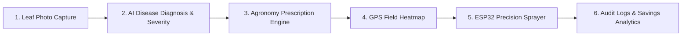

# AgriPrescribe 🌿
### Smartphone-Assisted Prescription Mapping & Automated Precision Spraying System
**Smart India Hackathon (SIH) 2026 Prototype**

AgriPrescribe is an end-to-end precision agriculture platform designed to reduce chemical pesticide consumption by up to **65%** through smartphone-assisted AI disease detection, automated prescription mapping, and targeted spot-spraying telemetry.

---

## 🎙️ Executive Summary & Pitch

> *"Traditional farming relies on blanket pesticide spraying, which wastes up to 70% of chemicals, contaminates soil and water bodies, and burdens farmers financially. **AgriPrescribe** is an end-to-end precision agriculture system that uses **smartphone AI disease diagnosis**, **automated agronomy prescription calculations**, and **GPS/ESP32 targeted spot-spraying** to reduce pesticide usage by up to **65%**."*

### 💡 Problem vs. AgriPrescribe Solution

| Challenge | Traditional Approach | AgriPrescribe Solution |
| :--- | :--- | :--- |
| **Pesticide Application** | **Blanket Spraying**: Spraying entire acres uniformly | **Targeted Spot Spraying**: Only diseased plants/zones get sprayed |
| **Dosage Precision** | **Guesswork**: Over-dosing or ineffective chemical mixes | **Algorithmic Agronomy Engine**: Exact dosage calculated per Liter/mL based on infection severity |
| **Hardware Costs** | Heavy tractor/drone setups unaffordable for smallholders | **Smartphone + Low-Cost ESP32**: Retrofittable IoT hardware for standard backpack/boom sprayers |
| **Environmental Impact** | Severe chemical run-off, soil degradation, and water toxicity | Up to **65.4% reduction** in active chemical volume |

---

## ⚙️ System Architecture & Workflow



1. **AI Disease Diagnosis**:
   - The farmer uploads or captures a leaf image via mobile/web.
   - The AI identifies the crop, classifies the disease (e.g., *Wheat Leaf Rust, Tomato Early Blight*), determines infection severity (`HEALTHY`, `LOW`, `MODERATE`, `HIGH`), and detects **lesion bounding boxes**.
2. **Agronomy Prescription Engine**:
   - Calculates the recommended chemical/organic formulation, exact dosage (e.g., $1.4\text{ mL/L}$), water volume, and safety warnings.
3. **Interactive GPS Field Heatmap**:
   - Pins diseased plant GPS locations and renders a color-coded intensity heatmap of infected zones across the field.
4. **Precision Sprayer Control (ESP32 / Simulation)**:
   - Dispatches spot-spraying telemetry to ESP32 microcontrollers controlling solenoid valves/nozzles (supports both real hardware and a real-time UI simulator).
5. **Analytics & Audit History**:
   - Logs every spray execution, tracking liters of pesticide saved, coverage, and total cost reduction (**~65.4% savings**).

---

## 🚀 Key Features

1. **Farmer Dashboard**: Real-time overview of field health, connected ESP32 sprayers, and chemical savings metrics.
2. **AI Plant Disease Diagnosis**: Instant camera capture or image upload -> disease classification, infection severity (`HEALTHY`, `LOW`, `MODERATE`, `HIGH`), and lesion bounding box visualization.
3. **Agronomy Prescription Engine**: Automatic calculation of chemical/organic formulations, dosage in mL/Liter, recommended water volume, and safety warnings.
4. **Field Prescription Heatmaps**: Interactive Leaflet maps displaying plant GPS pins, disease intensity heatmaps, and target spray zones.
5. **Precision Sprayer Controller**: Direct REST/MQTT communication with ESP32 microcontrollers + **Simulated Sprayer Mode** for live demonstration.
6. **Spray Execution History**: Audit log of past spray operations, chemical volume saved, and coverage tracking.
7. **Interactive Analytics**: Visual insights on disease distribution, pesticide volume reduction, and field health metrics.
8. **System Health Monitor**: Live API latency, database connection status, and AI engine telemetry.

---

## 🏗️ Tech Stack

- **Frontend**: React 18, TypeScript, Vite, Tailwind CSS, Lucide Icons, Leaflet Maps, Recharts, React Router
- **Backend**: Python 3.13, FastAPI, SQLAlchemy, Pydantic v2, SQLite, Pillow, OpenCV
- **AI Engine**: OpenCV feature extraction + Pluggable PyTorch/ONNX ML architecture
- **Hardware**: ESP32 C++ Firmware + Built-in Real-time Software Simulator

---

## ⚡ Quick Start Guide

### 1. Run Backend Server
```bash
cd backend
pip install -r requirements.txt
python -m app.main
```
Backend API will start at: `http://localhost:8000` (Swagger docs: `http://localhost:8000/docs`)

### 2. Run Frontend Web App
```bash
cd frontend
npm install
npm run dev
```
Frontend UI will start at: `http://localhost:5173`

---

## 🌾 Live Demo Workflow for Presentations

1. Open `http://localhost:5173` to view the **Farmer Dashboard**.
2. Click **AI Disease Detection** -> Upload a leaf photo or pick the **Wheat Leaf Rust** sample preset.
3. Observe instant **AI Diagnosis**, **Infection Severity (HIGH)**, and **Annotated Lesion Bounding Boxes**.
4. Click **Generate Precision Prescription** to get exact dosage formulas (e.g., $1.4\text{ mL / Liter}$, $280\text{ mL}$ target volume).
5. Navigate to **Prescription Map** to view the interactive GPS field heatmap.
6. Click **Trigger Precision Spray** -> Observe the live **Sprayer Simulator** in action!
7. Check **Analytics** to view the **65.4% pesticide savings** graph.

---
